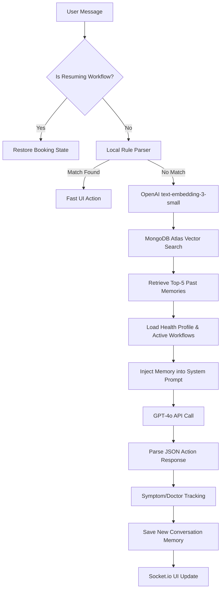

# 🧠 MediConnect AI — Personalized Healthcare Assistant

The MediConnect AI Assistant is a **Siri/ChatGPT-style personalized healthcare companion** built directly into the platform. 

Unlike standard chatbots that forget who you are after every session, this assistant features **Long-Term Memory, Semantic Vector Search, and Intelligent Workflow Resumption**. It remembers your health conditions, recurring symptoms, preferred doctors, and even unfinished booking processes.

---

## 🌟 Key Features

- **Long-Term Health Profile:** Automatically learns and tracks your health conditions, preferred doctors, and language preferences.
- **Symptom Tracking & Recognition:** Detects if you complain about the same symptom across multiple sessions (e.g., *"I notice you've mentioned breathing issues 3 times before..."*).
- **Workflow Resumption:** If you drop off during a doctor booking, the assistant remembers. Say *"Continue my booking"* next week, and it instantly resumes exactly where you left off.
- **Semantic Memory Search (RAG):** Uses OpenAI Embeddings and MongoDB Atlas Vector Search to retrieve contextually relevant past conversations.
- **Voice Support:** Built-in Speech-to-Text and Text-to-Speech support for hands-free interactions.
- **Graceful Degradation:** Seamlessly falls back to keyword-search if Vector Search isn't available (e.g., MongoDB free tier), and falls back to in-memory caching if Redis isn't running.

---

## 🏗️ Architecture & Request Lifecycle

The assistant utilizes an advanced **Retrieval-Augmented Generation (RAG)** pipeline. Here is exactly what happens when a user sends a message:



---

## 🗂️ Core Infrastructure

The implementation is split across several dedicated backend layers:

### 1. Database Models (`server/models/`)
- **`UserMemoryProfile.js`**: A permanent, user-scoped document storing confirmed health conditions, recurring symptoms, doctor interactions, and AI preferences.
- **`ConversationMemory.js`**: Stores individual conversation turns. Each message is converted into a 1536-dimensional array (`embedding`) for semantic search. Includes a 90-day auto-expiry (TTL).

### 2. Memory Engine (`server/memory/`)
- **`embeddingService.js`**: Wraps OpenAI's embedding API. Automatically skips embedding if `ENABLE_EMBEDDINGS=false` is set in the `.env` to save API costs.
- **`memoryManager.js`**: The core CRUD engine. Handles saving memories, executing the Atlas Vector Search pipeline, and persisting workflow states.
- **`ragContext.js`**: Executes parallel queries (Vector Search + Profile Load + Workflow Load) and formats the results into an optimized context string for the LLM.

### 3. Personalization Engine (`server/personalization/`)
- **`symptomTracker.js`**: A keyword-based NLP engine that extracts symptoms, maps them to 14 specialist categories (e.g., Cardiology, Pulmonology), and tracks their frequency.
- **`workflowContinuation.js`**: Detects intents like "continue booking" and reconstructs the frontend Redux/Zustand state so the user can seamlessly resume.

### 4. Controller Layer
- **`assistantController.js`**: The orchestrator. It intercepts the user's message, runs it through the RAG pipeline, calls GPT-4o, runs post-processing (symptom tracking), and returns the UI action.
- **`memoryController.js`**: 9 REST API endpoints for frontend consumption (e.g., fetching the user's profile on login).

---

## ⚙️ Setup & Configuration

The system is highly configurable via the `.env` file:

```env
# ─── MediAI Memory System ──────────────────────────────

# Set to 'false' to use keyword-based fallback (saves API cost)
ENABLE_EMBEDDINGS=true

# Embedding model to use
OPENAI_EMBEDDING_MODEL=text-embedding-3-small

# Redis for short-term caching (optional, leave blank for in-memory)
REDIS_URL=

# MongoDB Atlas Vector Search Settings
VECTOR_SEARCH_INDEX_NAME=memory_vector_index
VECTOR_SEARCH_TOP_K=5
```

### MongoDB Atlas Vector Search Setup

If you are running on a **MongoDB M10+ Cluster**, the system will automatically create the vector search index on startup. 

*(Note: Free M0 clusters do not support Vector Search. If the app detects an M0 cluster, it will safely fallback to standard Regex-based keyword search automatically.)*

If you need to create the index manually in the Atlas UI:
1. Go to **Search** -> **Create Search Index** -> **Vector Search** -> **JSON Editor**.
2. Select the `conversationmemories` collection.
3. Paste the following configuration:

```json
{
  "fields": [
    {
      "type": "vector",
      "path": "embedding",
      "numDimensions": 1536,
      "similarity": "cosine"
    },
    { "type": "filter", "path": "userId" },
    { "type": "filter", "path": "tags" }
  ]
}
```

---

## 🔐 Security & Privacy

- **User-Scoped Data:** Every memory operation requires a valid `userId`. The database strictly enforces `{ userId: req.user._id }` filters on all searches.
- **GDPR Compliance:** The `/api/assistant/memory/all` endpoint allows users to completely wipe their conversation history and vectors.
- **Auto-Expiry:** `ConversationMemory` utilizes MongoDB TTL indexes to automatically delete conversational context after 90 days, keeping the database light and privacy-friendly.
